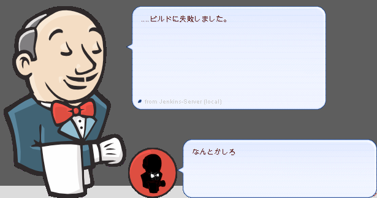

# Jenkins Ghost for SSP

[SSP](http://ssp.shillest.net/) (伺か) というデスクトップマスコットアプリケーション向けのジェンキンスさんゴースト。
Jenkins-CIとやりとりするためのサンプルスクリプトも付いています。

* デモムービー: http://www.youtube.com/watch?v=jXP9uEZTR6c
* 発表資料など: http://safx-dev.blogspot.jp/2013/04/5jenkins.html

## インストール

1. [SSP](http://ssp.shillest.net/)を導入する
2. このリポジトリデータを取得する
3. このリポジトリのjenkinsディレクトリをSSPのghostディレクトリ内にコピー
4. SSPを起動して「ゴーストを切り替え」でJenkinsを選択

## Jenkins-CIとの連携

* [発表資料など](http://safx-dev.blogspot.jp/2013/04/5jenkins.html)を参考に自作してください。
* `nc 127.0.0.1 9801 < sstp_sample/notify1`などで動作確認をしておくとよいでしょう。

## ゴーストの画像変更について

ゴーストの元素材のsvgはimagesに入っています。
修正はご自由にどうぞ。
